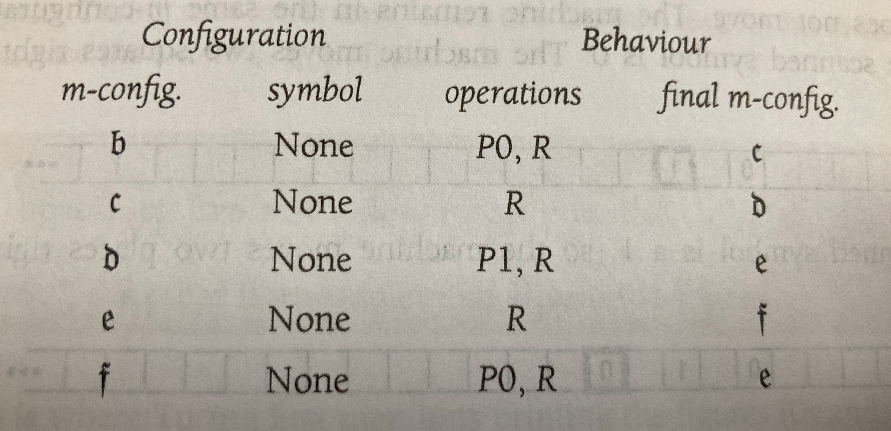
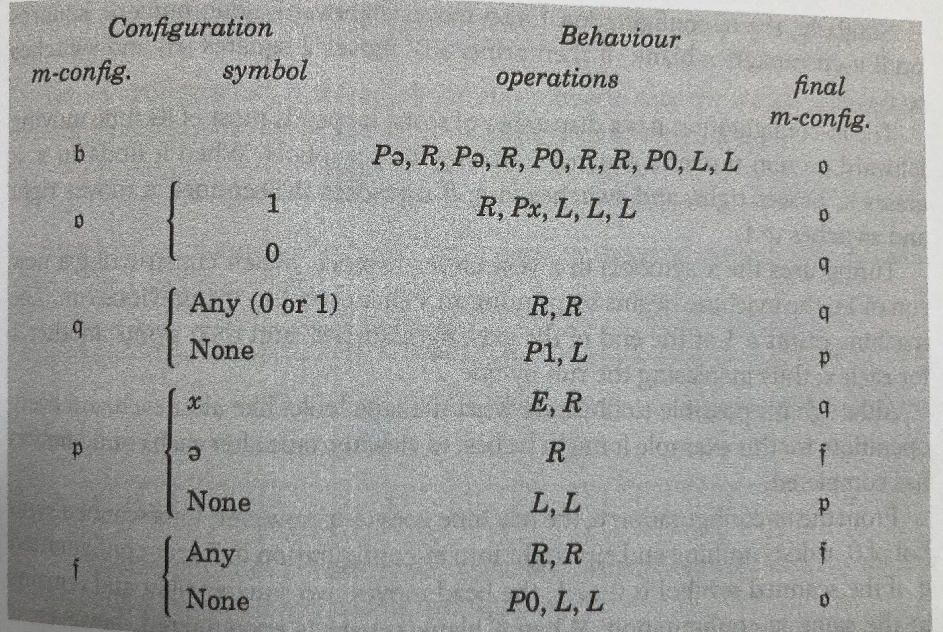

POJO-actor v1.x delivers a complete actor model foundation—ActorSystem, ActorRef with tell()/ask() messaging, virtual thread-based concurrency, and work-stealing pools—all in under 800 lines of code. Virtual threads enable even an ordinary laptop to handle tens of thousands of actors effortlessly. With no reflection and full GraalVM Native Image support, it turns any POJO into an actor without modification. 
 
 Version 2.x introduces a workflow engine that enables actors to become autonomous agents --- entities that observe their environment and act according to their state.


<!-- truncate -->

## From Actor to Agent: Introducing the Workflow Engine

In the actor model, each actor has a mailbox (message queue). Each actor retrieves messages from its queue one at a time and processes them sequentially. Meanwhile, multiple actors can operate independently and concurrently. This "sequential internally, parallel externally" structure allows programmers to achieve concurrent processing without worrying about locks.

The actor model is intuitive for humans, so it inherently has various applications. However, traditionally, implementations where one actor occupies one OS thread were common. This constrained the number of actors to the number of CPU cores, making large-scale applications difficult. With Virtual Threads since JDK 21, this constraint is being lifted. Being able to handle tens of thousands of actors opens up applications such as Agent-Based Simulations with many agents, or infrastructure-as-code platforms that monitor and autonomously repair computing resources.

As a foundation for enabling actors to behave autonomously—that is, to act as **Agents that observe their environment and act according to their state**—a **workflow engine** has been added in POJO-actor v2.x.

> An agent is anything that can be viewed as perceiving its environment through sensors and acting upon that environment through actuators.
> — Russell & Norvig, "Artificial Intelligence: A Modern Approach"


## actor-WF: Simplifying Workflows

POJO-actor's workflow (actor-WF) is described using a simple model of **"send this message to this actor"**:

```yaml
  - states: ["start", "processed"]
    actions:
      - actor: dataProcessor    # actor name
        method: process          # method name
        arguments: ["data.csv"]  # arguments
```

With just three elements—actor, method, and arguments—all steps can be expressed uniformly. This follows the same mental model as tell()/ask() in Java code, and since actors operate independently, parallel execution can be described naturally.

Workflow behavior, conditional branching, and loops are expressed as state transitions. actor-WF is essentially a Turing machine, and complex conditional branching that traditional YAML/JSON-based workflow languages struggle with can be expressed without introducing custom syntax.


## How actor-WF Works

actor-WF is essentially a Turing machine. Here we reproduce examples from Turing's original paper using actor-WF.

The following workflow is a Turing machine that computes the binary representation of the rational number 1/3. It writes symbols "0 1 0 1 0 1..." alternately on the tape while cycling through states 1→2→3→4→5→1.





> — Charles Petzold, "The Annotated Turing", Wiley Publishing, Inc. (2008)

```yaml
name: turing83
steps:
- states: ["0", "1"]
  actions:
  - actor: turing
    method: initMachine
- states: ["1", "2"]
  actions:
  - actor: turing
    method: printTape
- states: ["2", "3"]
  actions:
  - actor: turing
    method: put
    arguments: "0"
  - actor: turing
    method: move
    arguments: "R"
- states: ["3", "4"]
  actions:
  - actor: turing
    method: move
    arguments: "R"
- states: ["4", "5"]
  actions:
  - actor: turing
    method: put
    arguments: "1"
  - actor: turing
    method: move
    arguments: "R"
- states: ["5", "1"]
  actions:
  - actor: turing
    method: move
    arguments: "R"
```


### Workflow Behavior

A workflow has multiple **Rows** (combinations of `states` and `actions`) under `steps`. The Interpreter maintains a current state (initially `"0"`) and operates as follows.

#### State Matching and Transitions

Each Row's `states` is in the format `[from-state, to-state]`. The Interpreter searches from top to bottom for a Row with a from-state matching the current state.

Let's look at the turing83 example:

1. **Initial state**: current state = `"0"`
2. First Row `states: ["0", "1"]` matches
3. Execute `actions` (`initMachine`)
4. On success, update current state to `"1"`
5. Search for next matching Row → `states: ["1", "2"]`
6. Continue cycling: `"1"`→`"2"`→`"3"`→`"4"`→`"5"`→`"1"`→...

#### Action Execution and Conditional Branching

Each Row's `actions` are executed from top to bottom. Actions return either success (true) or failure (false).

- **All succeed**: Transition to to-state
- **Failure midway**: Abort this Row and try the next Row with the same from-state

This mechanism allows conditional branching by listing multiple Rows with the same from-state.

#### Termination Conditions

The workflow terminates under any of the following:
- Current state becomes `"end"` (success)
- No matching Row is found (failure)
- Maximum iteration count is reached (failure)

Since turing83 has no `"end"` state and is an infinite loop, it terminates when the maximum iteration count is reached.


### Running the Example

Clone https://github.com/scivicslab/actor-WF-examples, then build and run in the `actor-WF-examples` directory (requires JDK 21 or later):

```bash
git clone https://github.com/scivicslab/POJO-actor
cd POJO-actor
mvn clean install

git clone https://github.com/scivicslab/actor-WF-examples
cd actor-WF-examples
mvn compile
mvn exec:java -Dexec.mainClass="com.scivicslab.turing.TuringWorkflowApp" -Dexec.args="turing83"
```

**Output:**
```
Loading workflow from: /code/turing83.yaml
Workflow loaded successfully
Executing workflow...

TAPE    0    value
TAPE    0    value    0 1
TAPE    0    value    0 1 0 1
TAPE    0    value    0 1 0 1 0 1
TAPE    0    value    0 1 0 1 0 1 0 1
...

Workflow finished: Maximum iterations (50) exceeded
```

The pattern "0 1 0 1..." is generated on the tape. Since it's an infinite loop, it terminates when maxIterations (50) is reached.

## A More Complex Example

The following is a Turing machine that outputs an irrational number. It outputs 001011011101111011111...




> — Charles Petzold, "The Annotated Turing", Wiley Publishing, Inc. (2008)


Written in actor-WF:

```yaml
name: turing87
steps:
- states: ["0", "100"]
  actions:
  - actor: turing
    method: initMachine
- states: ["100", "1"]
  actions:
  - actor: turing
    method: printTape
- states: ["1", "2"]
  actions:
  - actor: turing
    method: put
    arguments: "e"
  - actor: turing
    method: move
    arguments: "R"
  - actor: turing
    method: put
    arguments: "e"
  - actor: turing
    method: move
    arguments: "R"
  - actor: turing
    method: put
    arguments: "0"
  - actor: turing
    method: move
    arguments: "R"
  - actor: turing
    method: move
    arguments: "R"
  - actor: turing
    method: put
    arguments: "0"
  - actor: turing
    method: move
    arguments: "L"
  - actor: turing
    method: move
    arguments: "L"
- states: ["101", "2"]
  actions:
  - actor: turing
    method: printTape
- states: ["2", "2"]
  actions:
  - actor: turing
    method: matchCurrentValue
    arguments: "1"
  - actor: turing
    method: move
    arguments: "R"
  - actor: turing
    method: put
    arguments: "x"
  - actor: turing
    method: move
    arguments: "L"
  - actor: turing
    method: move
    arguments: "L"
  - actor: turing
    method: move
    arguments: "L"
- states: ["2", "3"]
  actions:
  - actor: turing
    method: matchCurrentValue
    arguments: "0"
- states: ["3", "3"]
  actions:
  - actor: turing
    method: isAny
  - actor: turing
    method: move
    arguments: "R"
  - actor: turing
    method: move
    arguments: "R"
- states: ["3", "4"]
  actions:
  - actor: turing
    method: isNone
  - actor: turing
    method: put
    arguments: "1"
  - actor: turing
    method: move
    arguments: "L"
- states: ["4", "3"]
  actions:
  - actor: turing
    method: matchCurrentValue
    arguments: "x"
  - actor: turing
    method: put
    arguments: " "
  - actor: turing
    method: move
    arguments: "R"
- states: ["4", "5"]
  actions:
  - actor: turing
    method: matchCurrentValue
    arguments: "e"
  - actor: turing
    method: move
    arguments: "R"
- states: ["4", "4"]
  actions:
  - actor: turing
    method: isNone
  - actor: turing
    method: move
    arguments: "L"
  - actor: turing
    method: move
    arguments: "L"
- states: ["5", "5"]
  actions:
  - actor: turing
    method: isAny
  - actor: turing
    method: move
    arguments: "R"
  - actor: turing
    method: move
    arguments: "R"
- states: ["5", "101"]
  actions:
  - actor: turing
    method: isNone
  - actor: turing
    method: put
    arguments: "0"
  - actor: turing
    method: move
    arguments: "L"
  - actor: turing
    method: move
    arguments: "L"
```


This example includes **conditional branching using multiple Rows with the same from-state**.

```yaml
# From state 2: if current value is "1", stay in state 2
- states: ["2", "2"]
  actions:
    - actor: turing
      method: matchCurrentValue
      arguments: "1"
    # ... subsequent actions

# From state 2: if current value is "0", go to state 3
- states: ["2", "3"]
  actions:
    - actor: turing
      method: matchCurrentValue
      arguments: "0"
```

1. If `matchCurrentValue("1")` returns `true` → Execute first Row, remain in state 2
2. If `matchCurrentValue("1")` returns `false` → Abort this Row, try next Row
3. If `matchCurrentValue("0")` returns `true` → Transition to state 3


#### Running the Example

```bash
git clone https://github.com/scivicslab/POJO-actor
cd POJO-actor
mvn clean install

git clone https://github.com/scivicslab/actor-WF-examples
cd actor-WF-examples
mvn compile
mvn exec:java -Dexec.mainClass="com.scivicslab.turing.TuringWorkflowApp" -Dexec.args="turing87"
```


**Output:**
```
Loading workflow from: /code/turing87.yaml
Workflow loaded successfully
Executing workflow...

TAPE    0    value
TAPE    0    value    ee0 0 1 0
TAPE    0    value    ee0 0 1 0 1 1 0
TAPE    0    value    ee0 0 1 0 1 1 0 1 1 1 0
TAPE    0    value    ee0 0 1 0 1 1 0 1 1 1 0 1 1 1 1 0

Workflow finished: Maximum iterations (200) exceeded
```


## Summary

What we covered in this tutorial:

1. **Basic workflow structure**: Combinations of `states` and `actions`
2. **State transitions**: Control flow through transitions from from-state to to-state
3. **Conditional branching**: Achieved by listing multiple Rows with the same from-state
4. **Loops**: Achieved through state cycles (e.g., 1→2→3→4→5→1)

actor-WF is based on the same design philosophy as Turing machines. Any complexity of processing can be expressed through combinations of state transitions and actions.

## Next Steps

To create your own workflows, you need to implement an adapter (IIActorRef) to call POJOs from workflows. See the following for details:

- [IIActorRef Implementation Guide](../../020_specs/020_workflow/025_IIActorRefSpecs_251231_oo01/)

---

## References

- **POJO-actor**: [https://github.com/scivicslab/POJO-actor](https://github.com/scivicslab/POJO-actor)
- **actor-WF-examples**: [https://github.com/scivicslab/actor-WF-examples](https://github.com/scivicslab/actor-WF-examples)

