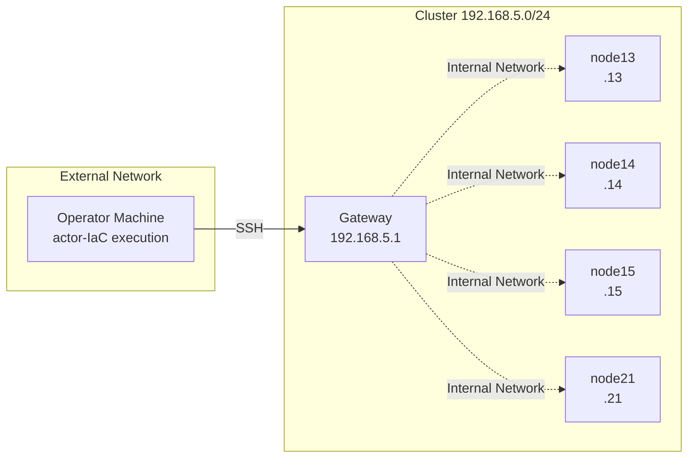

actor-IaC sends commands to remote nodes via SSH. The SSH Connection Requirements tutorial explains the requirements and configuration methods for actor-IaC to connect to remote nodes.


## Prerequisites: Operator Machine and Cluster Configuration

actor-IaC connects via SSH from the operator machine to each node within the cluster to execute commands. The operator machine refers to the machine where users execute actor-IaC.



The SSH Connection Requirements tutorial assumes the following configuration:

| Item | Value |
|------|-------|
| Gateway IP Address | 192.168.5.1 |
| Compute Node IP Addresses | 192.168.5.13, .14, .15, .21, .22, .23 |
| SSH Username | devteam |

The access method from the operator machine to cluster nodes varies depending on the network location of the operator machine:

- **When the operator machine is within the cluster**: The operator machine can directly SSH connect to each compute node
- **When the operator machine is outside the cluster**: The operator machine SSH connects to each compute node via the gateway (using ProxyJump feature)


## SSH Authentication

actor-IaC supports two authentication methods: public key authentication and password authentication.

### Public Key Authentication

In public key authentication, actor-IaC performs authentication using a pair of the private key on the operator machine and the public key registered in the `~/.ssh/authorized_keys` file on the remote node.

**When using a key without passphrase**

When no passphrase is set on the private key, users specify the key file path in the `~/.ssh/config` file on the operator machine. actor-IaC automatically reads and uses the key file specified in the `~/.ssh/config` file.

**`~/.ssh/config` configuration example when the operator machine is within the cluster (direct connection):**

```
Host 192.168.5.*
    User devteam
    IdentityFile ~/.ssh/id_ed25519_cluster
```

When users write the above content to the `~/.ssh/config` file on the operator machine, for SSH connections to hosts matching `192.168.5.*`, the SSH client uses the username `devteam` and the key file `~/.ssh/id_ed25519_cluster`.

**`~/.ssh/config` configuration example when the operator machine is outside the cluster (via gateway):**

```
Host gateway
    HostName 192.168.5.1
    User devteam
    IdentityFile ~/.ssh/id_ed25519_cluster

Host 192.168.5.*
    User devteam
    IdentityFile ~/.ssh/id_ed25519_cluster
    ProxyJump gateway
```

When users write the above content to the `~/.ssh/config` file on the operator machine, for SSH connections to hosts matching `192.168.5.*`, the SSH client first SSH connects to the gateway (192.168.5.1), then SSH connects from the gateway to the target compute node, performing a multi-hop connection. The `ProxyJump gateway` directive instructs the SSH client to perform multi-hop connection.

**When using a key with passphrase**

When a passphrase is set on the private key, users need to register the private key with the ssh-agent process in addition to configuring the `~/.ssh/config` file on the operator machine. ssh-agent is a daemon process that holds the passphrase entered by users once in memory. When the private key is registered with ssh-agent, actor-IaC can use the private key through ssh-agent, and users will not be prompted for the passphrase during actor-IaC execution.

Users execute the following commands on the operator machine to start the ssh-agent process and register the private key:

```bash
eval "$(ssh-agent -s)"
ssh-add ~/.ssh/id_ed25519_cluster
```

When executing the `ssh-add` command, ssh-add prompts users for the passphrase. When users enter the passphrase, ssh-agent holds the private key in memory. After registration with ssh-agent, actor-IaC uses the private key through ssh-agent to connect to remote nodes.

:::note
Ed25519 format private keys require registration with ssh-agent regardless of whether a passphrase is set. If users execute actor-IaC without registering the Ed25519 format private key with ssh-agent, actor-IaC fails to connect to remote nodes. The reason Ed25519 format private keys require registration with ssh-agent is that the SSH library (JSch) used by actor-IaC does not support the functionality to directly read Ed25519 format private key files.
:::

### Password Authentication

In password authentication, actor-IaC performs authentication using the user password of the remote node. When users specify the `--ask-pass` option at actor-IaC execution time, actor-IaC prompts users for the password only once at startup. actor-IaC uses the password entered by users for SSH connections to all nodes.

```bash
./actor_iac.java run -d ./sysinfo -w main-collect-sysinfo -i inventory.ini -g compute --ask-pass
```

:::note
To use the `--ask-pass` option, users need to install the sshpass package on the operator machine. On Ubuntu/Debian, users can install the sshpass package with the following command:
```bash
sudo apt install sshpass
```
:::


## sudo Execution

When executing commands that require root privileges within workflows, users use the `executeSudoCommand` method in the workflow YAML file. The `executeSudoCommand` method uses the password set in the environment variable `SUDO_PASSWORD` to automatically respond to sudo password prompts on remote nodes.

### 1. Set the sudo Password in Environment Variable

Users set the sudo password for remote nodes in the environment variable `SUDO_PASSWORD` in the shell on the operator machine before executing actor-IaC. The actor-IaC process reads the environment variable `SUDO_PASSWORD` at startup and uses the sudo password when executing the `executeSudoCommand` method.

```bash
export SUDO_PASSWORD="your-sudo-password"
```

### 2. Call the `executeSudoCommand` Method in the Workflow

Users use the `executeSudoCommand` method instead of the regular `executeCommand` method in the workflow YAML file. The command string passed to the `executeSudoCommand` method does not need to include the `sudo` prefix. The `executeSudoCommand` method automatically executes the command received as an argument with sudo.

```yaml
steps:
  - states: ["0", "end"]
    actions:
      - actor: this
        method: executeSudoCommand
        arguments:
          - "apt update && apt upgrade -y"
```

### 3. Execute the Workflow

Users execute actor-IaC normally with the environment variable `SUDO_PASSWORD` set.

```bash
./actor_iac.java run -d ./sysinfo -w main-collect-sysinfo -i inventory.ini -g compute
```

:::note
If users execute actor-IaC without setting the environment variable `SUDO_PASSWORD` and the workflow calls the `executeSudoCommand` method, actor-IaC outputs the error message "SUDO_PASSWORD environment variable is not set" and aborts processing.
:::


## Troubleshooting

When SSH connection errors occur during actor-IaC execution, users identify the cause using the following steps.

### Isolate SSH Connection Issues

Users test connection to remote nodes directly with the ssh command from the operator machine without going through actor-IaC. Connection testing with the ssh command allows users to isolate whether the problem is in SSH settings or an actor-IaC-specific issue.

```bash
ssh -o BatchMode=yes devteam@192.168.5.13 "echo OK"
```

The `-o BatchMode=yes` option instructs the ssh command to disable interactive password input. Since actor-IaC internally performs SSH connections in a mode equivalent to BatchMode, if users cannot connect with the ssh command with the `-o BatchMode=yes` option, actor-IaC also cannot connect.

### Resolution by Error Type

**When `Connection refused` error is displayed**

The `Connection refused` error indicates that the SSH server (sshd process) on the remote node is not running. Users log into the remote node via console or other means and start the SSH server with the following command:

```bash
sudo systemctl start sshd
```

**When `Permission denied` error is displayed**

The `Permission denied` error indicates that SSH authentication failed. Users execute the following command on the operator machine to check whether the private key is registered with ssh-agent:

```bash
ssh-add -l
```

If no private key is displayed in the `ssh-add -l` command output, users register the private key with ssh-agent using the following command:

```bash
ssh-add ~/.ssh/id_ed25519_cluster
```

If users want to connect using password authentication instead of public key authentication, users specify the `--ask-pass` option when executing actor-IaC.

**When `SUDO_PASSWORD environment variable is not set` error is displayed**

The `SUDO_PASSWORD environment variable is not set` error indicates that the workflow YAML file uses the `executeSudoCommand` method but the environment variable `SUDO_PASSWORD` is not set. Users set the environment variable `SUDO_PASSWORD` in the shell on the operator machine before executing actor-IaC:

```bash
export SUDO_PASSWORD="your-sudo-password"
```
