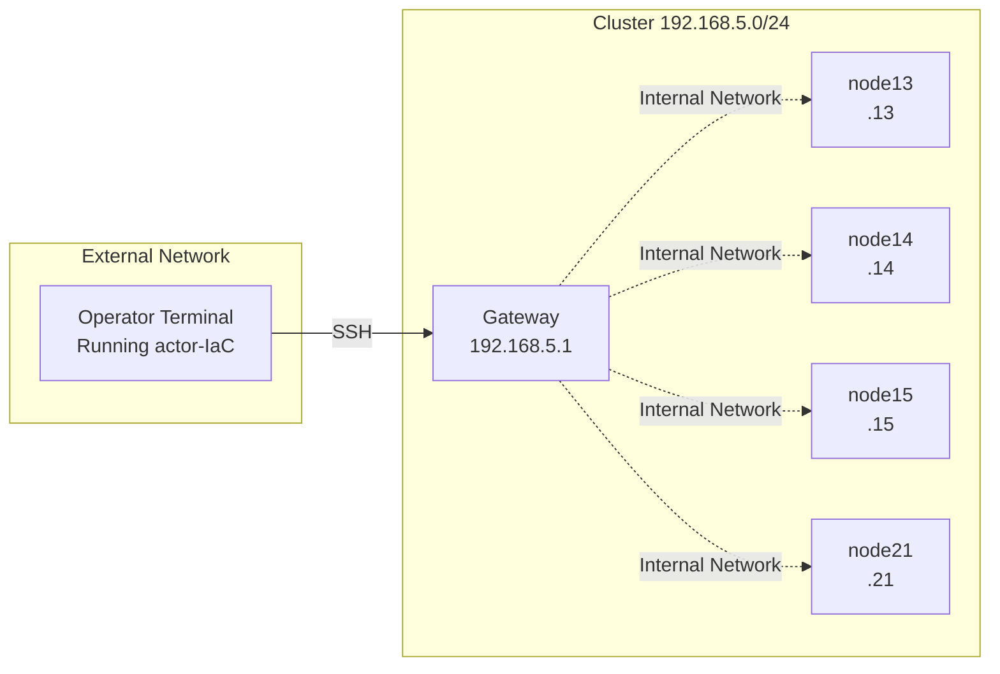

:::caution Newer Version Available
This is documentation for version 2.13.0. [See the latest version](/docs/actor-iac/introduction).
:::

## Problem Definition

**Goal:** Use actor-IaC to collect system information (CPU, memory, disk, GPU, OS, network) from multiple compute nodes in a cluster.

In cluster management, understanding the configuration information of each node is a fundamental and important task. Using actor-IaC, you can execute the same information collection process in parallel on multiple nodes.


## Network Configuration Assumed

This tutorial assumes a configuration where the operator terminal connects to compute nodes in the cluster via SSH. The following diagram shows the network configuration between the operator terminal and the cluster. The operator terminal is the machine running actor-IaC, and if located on a network external to the cluster, it accesses each compute node via a gateway.



This tutorial uses the following network configuration as an example.

| Item | Value |
|------|-------|
| Gateway IP address | 192.168.5.1 |
| Compute node IP addresses | 192.168.5.13, .14, .15, .21, .22, .23 |
| SSH username | youruser |


## Tutorial Structure

This tutorial proceeds in the following order.

### Satisfying Prerequisites

For actor-IaC to connect to remote nodes, SSH authentication must be configured. Choose either public key authentication or password authentication.

- [SSH Connection with Public Key Authentication](./025-ssh-requirements): Configure authentication using SSH key pairs. Recommended for security and convenience.

### Main Topic

Once prerequisites are met, create and execute a workflow.


## How to do it

### Prerequisites

- actor-IaC must be installed (refer to installation tutorial)
- SSH requirements must be satisfied


### 1. Create Working Directory

```bash
mkdir -p ~/works/testcluster-iac/sysinfo
cd ~/works/testcluster-iac
```


### 2. Create Inventory File

Define the target nodes for system information collection in `inventory.ini`.

```bash
cat > inventory.ini << 'EOF'
[compute]
node13 actoriac_host=192.168.5.13
node14 actoriac_host=192.168.5.14
node15 actoriac_host=192.168.5.15
node21 actoriac_host=192.168.5.21
node22 actoriac_host=192.168.5.22
node23 actoriac_host=192.168.5.23

[compute:vars]
actoriac_user=youruser
EOF
```

| Item | Description |
|------|-------------|
| `[compute]` | Group name |
| `node13` to `node23` | Identifier for each node |
| `actoriac_host=...` | IP address of each node |
| `[compute:vars]` | Variables applied to the entire group |
| `actoriac_user=youruser` | SSH connection username |


### 3. Create Sub-Workflow

Create the sub-workflow that will be executed on each node in `sysinfo/collect-sysinfo.yaml`.

```bash
cat > sysinfo/collect-sysinfo.yaml << 'EOF'
name: collect-sysinfo

description: |
  Sub-workflow to collect system information from each compute node.
  Retrieves hostname, OS, CPU, memory, disk, GPU, and network information.

steps:
  - states: ["0", "1"]
    note: Retrieve hostname and OS information
    actions:
      - actor: this
        method: executeCommand
        arguments:
          - |
            echo "===== HOSTNAME ====="
            hostname -f
            echo ""
            echo "===== OS INFO ====="
            cat /etc/os-release | grep -E "^(NAME|VERSION|ID)="
            uname -a

  - states: ["1", "2"]
    note: Retrieve CPU architecture, core count, and model name
    actions:
      - actor: this
        method: executeCommand
        arguments:
          - |
            echo "===== CPU INFO ====="
            lscpu | grep -E "^(Architecture|CPU\(s\)|Model name|Thread|Core|Socket)"

  - states: ["2", "3"]
    note: Retrieve memory capacity (total, used, free)
    actions:
      - actor: this
        method: executeCommand
        arguments:
          - |
            echo "===== MEMORY INFO ====="
            free -h

  - states: ["3", "4"]
    note: Retrieve disk device list and mount status
    actions:
      - actor: this
        method: executeCommand
        arguments:
          - |
            echo "===== DISK INFO ====="
            lsblk -d -o NAME,SIZE,TYPE,MODEL 2>/dev/null || lsblk -d -o NAME,SIZE,TYPE
            echo ""
            df -h | grep -E "^(/dev|Filesystem)"

  - states: ["4", "5"]
    note: Retrieve GPU presence and model name (uses nvidia-smi for NVIDIA GPUs)
    actions:
      - actor: this
        method: executeCommand
        arguments:
          - |
            echo "===== GPU INFO ====="
            if command -v nvidia-smi &> /dev/null; then
                nvidia-smi --query-gpu=name,memory.total,driver_version --format=csv,noheader 2>/dev/null || echo "nvidia-smi failed"
            else
                lspci 2>/dev/null | grep -i -E "(vga|3d|display)" || echo "No GPU detected via lspci"
            fi

  - states: ["5", "end"]
    note: Retrieve network interfaces and IP addresses
    actions:
      - actor: this
        method: executeCommand
        arguments:
          - |
            echo "===== NETWORK INFO ====="
            ip -4 addr show | grep -E "(^[0-9]+:|inet )" | head -20
EOF
```


### 4. Create Main Workflow

Create the main workflow that calls the sub-workflow in `sysinfo/main-collect-sysinfo.yaml`.

```bash
cat > sysinfo/main-collect-sysinfo.yaml << 'EOF'
name: main-collect-sysinfo

description: |
  Main workflow to collect system information from all compute nodes in parallel.
  Executes collect-sysinfo.yaml on each node.

steps:
  - states: ["0", "end"]
    note: Execute collect-sysinfo.yaml in parallel on all nodes
    actions:
      - actor: nodeGroup
        method: apply
        arguments:
          actor: "node-*"
          method: runWorkflow
          arguments: ["collect-sysinfo.yaml"]
EOF
```


### 5. Execute Workflow

```bash
./actor_iac.java run -w sysinfo/main-collect-sysinfo.yaml -i inventory.ini -g compute
```

| Option | Description |
|--------|-------------|
| `-w sysinfo/main-collect-sysinfo.yaml` | Workflow file to execute |
| `-i inventory.ini` | Inventory file |
| `-g compute` | Target group |

actor-IaC executes sub-workflows in parallel on 6 nodes. Output from each node is prefixed with `[node-node13]` etc. All logs are automatically saved to `actor-iac-logs.mv.db`.

If SSH authentication errors occur, refer to the troubleshooting section in SSH requirements.


### 6. Directory Structure

Directory structure after completion:

```
~/works/testcluster-iac/
├── actor_iac.java
├── actor-iac-logs.mv.db    ← Automatically created after execution
├── inventory.ini
└── sysinfo/
    ├── collect-sysinfo.yaml
    └── main-collect-sysinfo.yaml
```


### 7. Verify Workflow Contents (Optional)

You can verify workflow contents with the `describe` command.

**Workflow list:**
```bash
./actor_iac.java list -w sysinfo
```

**Workflow details:**
```bash
./actor_iac.java describe -w sysinfo/collect-sysinfo.yaml --steps
```

If you write `description:` and `note:` in the workflow, you can verify them with the `describe` command.


## Under the hood

### Actor Tree Generation

When executing a workflow, actor-IaC reads the inventory file and generates an actor tree. actor-IaC generates a node actor corresponding to each node definition in the inventory file and places it as a child actor of the nodeGroup actor. In the above example, 6 node actors are generated for 6 nodes (node13 to node23).

```
ROOT actor
└── nodeGroup actor ("nodeGroup")
    ├── node-node13 actor
    ├── node-node14 actor
    ├── node-node15 actor
    ├── node-node21 actor
    ├── node-node22 actor
    └── node-node23 actor
```

The purpose of actor-IaC is to execute the same configuration tasks in parallel on multiple servers. To achieve parallel execution, actor-IaC places multiple node actors as child actors under the nodeGroup actor.

| Actor | Role |
|-------|------|
| nodeGroup actor | Executes the main workflow. Controls which sub-workflows to execute on which nodes |
| node actor | Executes sub-workflows. Defines the specific commands to execute on each node |

### Parallel Execution of Sub-Workflows

When the main workflow `main-collect-sysinfo.yaml` calls the `nodeGroup.apply()` method, the nodeGroup actor executes the sub-workflow `collect-sysinfo.yaml` in parallel on all child actors matching the specified pattern (`node-*`). Each node actor executes commands on the remote node through SSH connection and returns the results.

For log output aggregation and persistence, refer to the tutorial on utilizing results.
