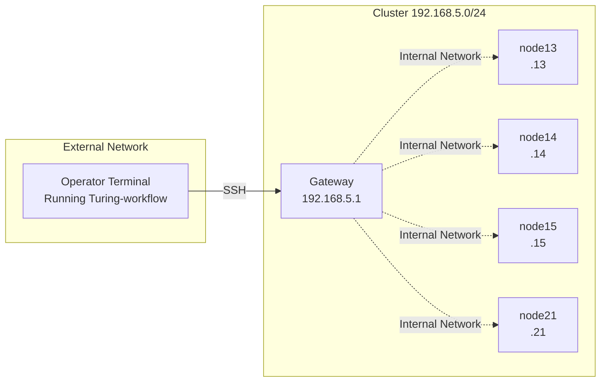

# Collecting System Information from a Cluster

## Problem Definition

In cluster management, understanding the configuration information of each node (CPU, memory, disk, GPU, OS, network) is a fundamental and important task. Using Turing-workflow, you can define target nodes in an inventory file and execute the same information collection process in parallel across multiple nodes.

### Assumed Network Configuration

This assumes a configuration where you SSH connect from an operator terminal to compute nodes in the cluster. The operator terminal is the machine running Turing-workflow, and if it is located on a network outside the cluster, it accesses each compute node through a gateway.



| Item | Value |
|------|-------|
| Gateway IP address | 192.168.5.1 |
| Compute node IP addresses | 192.168.5.13, .14, .15, .21, .22, .23 |
| SSH username | youruser |

If the operator terminal is inside the cluster, you can SSH directly to each node. If the operator terminal is outside the cluster, use SSH's ProxyJump feature through the gateway.


## How to do it

### 1. Create the Inventory File

Define the target nodes for system information collection in `inventory.ini`.

```ini
[compute]
node13 actoriac_host=192.168.5.13
node14 actoriac_host=192.168.5.14
node15 actoriac_host=192.168.5.15
node21 actoriac_host=192.168.5.21
node22 actoriac_host=192.168.5.22
node23 actoriac_host=192.168.5.23

[compute:vars]
actoriac_user=youruser
```

| Item | Description |
|------|-------------|
| `[compute]` | Group name |
| `node13` -- `node23` | Identifier for each node |
| `actoriac_host=...` | IP address of each node |
| `[compute:vars]` | Variables applied to the entire group |
| `actoriac_user=youruser` | SSH connection username |

### 2. Create the Sub-workflow

Create the sub-workflow that will be executed on each node in `sysinfo/collect-sysinfo.yaml`.

```yaml
name: collect-sysinfo

description: |
  Sub-workflow to collect system information from each compute node.
  Retrieves hostname, OS, CPU, memory, disk, GPU, and network information.

steps:
  - states: ["0", "1"]
    note: Retrieve hostname and OS information
    actions:
      - actor: this
        method: executeCommand
        arguments:
          - |
            echo "===== HOSTNAME ====="
            hostname -f
            echo ""
            echo "===== OS INFO ====="
            cat /etc/os-release | head -5
            uname -a

  - states: ["1", "2"]
    note: Retrieve CPU architecture, core count, and model name
    actions:
      - actor: this
        method: executeCommand
        arguments:
          - |
            echo "===== CPU INFO ====="
            lscpu | head -15

  - states: ["2", "3"]
    note: Retrieve memory capacity (total, used, free)
    actions:
      - actor: this
        method: executeCommand
        arguments:
          - |
            echo "===== MEMORY INFO ====="
            free -h

  - states: ["3", "4"]
    note: Retrieve disk device list and mount status
    actions:
      - actor: this
        method: executeCommand
        arguments:
          - |
            echo "===== DISK INFO ====="
            lsblk -d -o NAME,SIZE,TYPE,MODEL 2>/dev/null || lsblk -d -o NAME,SIZE,TYPE
            echo ""
            df -h | head -10

  - states: ["4", "5"]
    note: Retrieve GPU presence and model name (uses nvidia-smi for NVIDIA GPUs)
    actions:
      - actor: this
        method: executeCommand
        arguments:
          - |
            echo "===== GPU INFO ====="
            if command -v nvidia-smi &> /dev/null; then
                nvidia-smi --query-gpu=name,memory.total,driver_version --format=csv,noheader 2>/dev/null || echo "nvidia-smi failed"
            else
                lspci 2>/dev/null | head -5 || echo "No GPU detected via lspci"
            fi

  - states: ["5", "end"]
    note: Retrieve network interfaces and IP addresses
    actions:
      - actor: this
        method: executeCommand
        arguments:
          - |
            echo "===== NETWORK INFO ====="
            ip -4 addr show | head -20
```

The sub-workflow consists of 6 steps. Each step sequentially collects hostname/OS, CPU, memory, disk, GPU, and network information.

### 3. Create the Main Workflow

Create the main workflow that calls the sub-workflow in `sysinfo/main-collect-sysinfo.yaml`.

```yaml
name: main-collect-sysinfo

description: |
  Main workflow to collect system information from all compute nodes in parallel.
  Executes collect-sysinfo.yaml on each node.

steps:
  - states: ["0", "end"]
    note: Execute collect-sysinfo.yaml in parallel on all nodes
    actions:
      - actor: nodeGroup
        method: apply
        arguments:
          actor: "node-*"
          method: runWorkflow
          arguments: ["collect-sysinfo.yaml"]
```

The main workflow uses the `nodeGroup.apply()` method to execute the sub-workflow in parallel on all node actors matching the `node-*` pattern.

### 4. Run the Workflow

```bash
./turing_workflow.java run -w sysinfo/main-collect-sysinfo.yaml -i inventory.ini -g compute
```

| Option | Description |
|--------|-------------|
| `-w sysinfo/main-collect-sysinfo.yaml` | Workflow file to execute |
| `-i inventory.ini` | Inventory file |
| `-g compute` | Target group |

Turing-workflow executes the sub-workflow in parallel on 6 nodes. Output from each node is prefixed with `[node-node13]` or similar. All logs are automatically saved to `turing-workflow-logs.mv.db`.

### 5. Directory Structure

The directory structure after completing the work is as follows.

```
~/works/testcluster/
├── turing_workflow.java
├── Turing-workflow-3.0.0.jar
├── turing-workflow-logs.mv.db    ← Automatically created after execution
├── inventory.ini
└── sysinfo/
    ├── collect-sysinfo.yaml
    └── main-collect-sysinfo.yaml
```


## Under the hood

### Actor Tree Generation

When executing a workflow, Turing-workflow reads the inventory file and generates an actor tree. Turing-workflow creates node actors corresponding to each node definition in the inventory file and places them as child actors of the `nodeGroup` actor. In the example above, 6 node actors are generated for the 6 nodes (node13 -- node23).

```
ROOT Actor
└── nodeGroup Actor ("nodeGroup")
    ├── node-node13 Actor
    ├── node-node14 Actor
    ├── node-node15 Actor
    ├── node-node21 Actor
    ├── node-node22 Actor
    └── node-node23 Actor
```

The purpose of Turing-workflow is to execute identical configuration tasks in parallel across multiple servers. To achieve parallel execution, multiple node actors are placed as child actors under the `nodeGroup` actor.

| Actor | Role |
|-------|------|
| `nodeGroup` Actor | Executes the main workflow. Controls parallel execution of sub-workflows on target nodes |
| node Actor | Executes sub-workflows. Executes commands on remote nodes through SSH connections |

### Parallel Execution of Sub-workflows

When the main workflow `main-collect-sysinfo.yaml` calls the `nodeGroup.apply()` method, `NodeGroupInterpreter` executes the sub-workflow `collect-sysinfo.yaml` in parallel on all child actors matching the specified pattern (`node-*`). Each `NodeIIAR` actor executes commands on remote nodes through SSH connections and returns the results.
